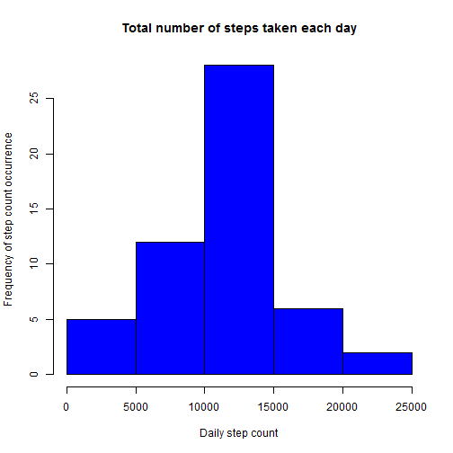
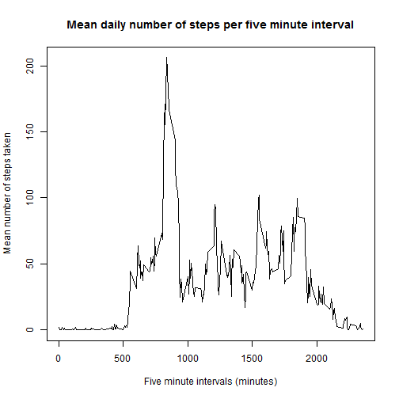
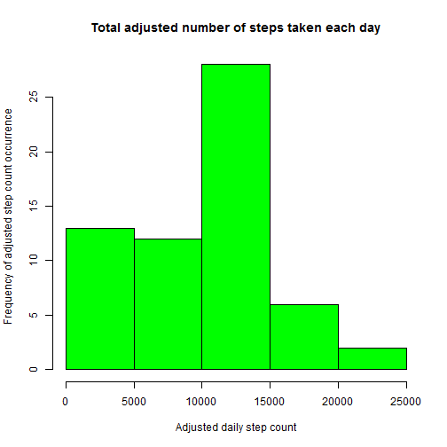
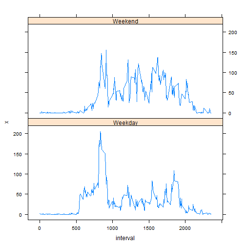

# Peer Graded Assignment: Course Project 1
## Reproducible Research - week 2

It is now possible to collect a large amount of data about personal movement using activity monitoring devices such as a Fitbit, Nike Fuelband, or Jawbone Up. These type of devices are part of the "quantified self" movement - a group of enthusiasts who take measurements about themselves regularly to improve their health, to find patterns in their behavior, or because they are tech geeks. But these data remain under-utilized both because the raw data are hard to obtain and there is a lack of statistical methods and software for processing and interpreting the data.

## Loading and preprocessing the data

```r
# set these options for displaying numerics appropriately in RMarkdown
options(scipen=1, digits=3)
setwd("D:/My Folders/R/2016/coursera/mod_5_week_2/")
# load data from zip
activity <- unzip("repdata_data_activity.zip")
activity <- read.csv(activity)
# convert date data to dates
activity$date <- as.Date(activity$date)
```

## What is mean total number of steps taken per day? 

1. Calculate the total number of steps taken per day

```r
steps.day <- aggregate(steps~date, activity, sum)
tot.steps <- sum(steps.day$steps)
```

The total number of steps taken during the sampling period was 570608.

2. Make a histogram of the total number of steps taken each day

```r
hist(steps.day$steps,
     main = "Total number of steps taken each day",
     xlab = "Daily step count",
     ylab = "Frequency of step count occurrence",
     col = "blue")
```



3. Calculate and report the mean and median of the total number of steps taken per day

```r
mean.steps <- mean(steps.day$steps, na.rm = TRUE)
median.steps <- median(steps.day$steps, na.rm = TRUE)
```
The mean number of steps taken during the sampling period was 10766.189 while the median was 10765.

## What is the average daily activity pattern?

1. Make a time series plot (i.e. type = "l") of the 5-minute interval (x-axis) and the average number of steps taken, averaged across all days (y-axis)

```r
steps.interval <- aggregate(steps~interval, activity, mean)
plot(steps.interval$interval, steps.interval$steps,
     type = "l",
     main = "Mean daily number of steps per five minute interval",
     xlab = "Five minute intervals (minutes)",
     ylab = "Mean number of steps taken")
```



2. Which 5-minute interval, on average across all the days in the dataset, contains the maximum number of steps?

```r
max.int <- steps.interval$interval[steps.interval$steps == max(steps.interval$steps)]
```

The highest mean number of steps were taken during interval 835.

## Imputing missing values

Note that there are a number of days/intervals where there are missing values (coded as NA). The presence of missing days may introduce bias into some calculations or summaries of the data.

1. Calculate and report the total number of missing values in the dataset (i.e. the total number of rows with NAs)

```r
num.na <- sum(is.na(activity))
```
There are 2304 missing values (coded as NA) in the dataset.

2. Devise a strategy for filling in all of the missing values in the dataset. The strategy does not need to be sophisticated. For example, you could use the mean/median for that day, or the mean for that 5-minute interval, etc.

3. Create a new dataset that is equal to the original dataset but with the missing data filled in.

```r
# replace NA's with median values for the appropriate 5-minute interval
activity.adj <- activity
for (i in 1:nrow(activity.adj)){
    if (is.na(activity.adj$steps[i])) {
        interval <- activity.adj$interval[i]
        activity.adj$steps[i] <- median(activity.adj$steps[which(activity.adj$interval == interval)], 
                                        na.rm = TRUE)
        }
}
```

4. Make a histogram of the total number of steps taken each day and Calculate and report the mean and median total number of steps taken per day. Do these values differ from the estimates from the first part of the assignment? What is the impact of imputing missing data on the estimates of the total daily number of steps?

```r
steps.day.adj <- aggregate(steps~date, activity.adj, sum)

hist(steps.day.adj$steps,
     main = "Total adjusted number of steps taken each day",
     xlab = "Adjusted daily step count",
     ylab = "Frequency of adjusted step count occurrence",
     col = "green")
```



```r
mean.steps.adj <- mean(steps.day.adj$steps, na.rm = TRUE)
median.steps.adj <- median(steps.day.adj$steps, na.rm = TRUE)
```

After replacing missing step number data with median values for the interval, the mean number of steps taken during the sampling period was 9503.869 while the median was 10395. the mean and median numbers of steps changed by -1262.32 and -370 respectively.

Introducing the median interval values to replace missing step number data has dropped both the mean and median of the total numbers of steps taken. Additionally, the histogram of adjusted values suggests that the frequency of days with lower step numbers have increased.

## Are there differences in activity patterns between weekdays and weekends?

1. Create a new factor variable in the dataset with two levels -- "weekday" and "weekend" indicating whether a given date is a weekday or weekend day.

```r
# add a column named day.type and populate it with "Weekday"
activity.adj$day.type <- "Weekday"
# Replace "Weekday" with "Weekend" wherever the weekdays function returns a Saturday or Sunday.
activity.adj$day.type[weekdays(activity.adj$date) == "Saturday" | weekdays(activity.adj$date) == "Sunday"] <- "Weekend" 
```

2. Make a panel plot containing a time series plot (i.e. type = "l") of the 5-minute interval (x-axis) and the average number of steps taken, averaged across all weekday days or weekend days (y-axis).


```r
steps.interval.adj <- with(activity.adj, 
                           aggregate(steps,
                                     list(interval = interval, day.type = day.type), 
                                     mean))
library(lattice)
with(steps.interval.adj,
     xyplot(x ~ interval | day.type,
            type = 'l',
            layout = c(1, 2))
)
```



Overall there do appear to be some differences in activity levels on week v.s. weekend days. Activity levels are higher, earlier during the week. On weekends, higher activity levels are sustained throughout the day than on weekdays. This makes intuitive sense when one considers that the subject may sleep in on weekends, and may have a sedentary job during the week.


